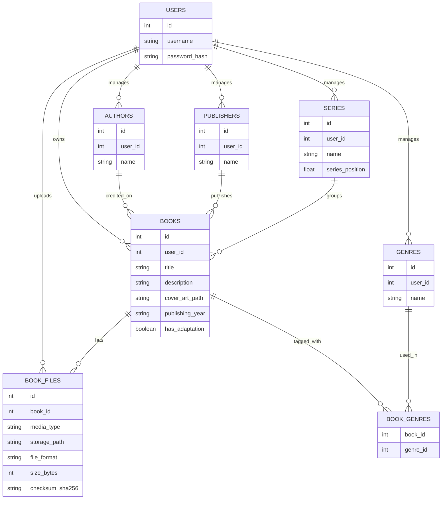
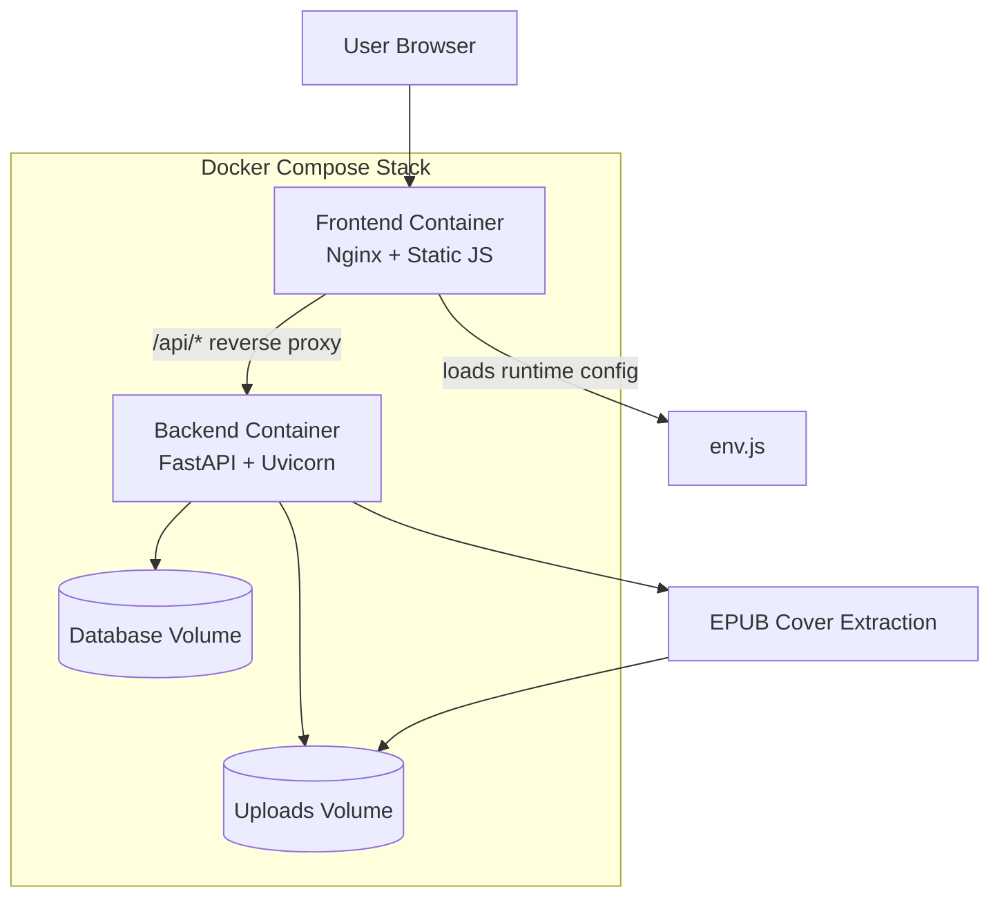

# Final Project Report — Self-Hosted Bookshelf

## Project Summary (1–3 sentences)

Self-Hosted Bookshelf is a lightweight web app for managing a personal EPUB library. Users can upload EPUB files, create/edit metadata, automatically extract and display cover thumbnails, and download stored books later. The project is designed to be easy to run and self-host using Docker Compose.

## Diagrams

### ERD (Initial Data Model)

### System Design (Docker Compose + Reverse Proxy)

## Demo Video or GIF (TODO)

Add your demo GIF file in this repo at:

- `docs/demo.gif`

Then embed it here by replacing the placeholder below:

## What Did You Learn? (TODO — at least 3)

- Learning 1: 
- Learning 2: 
- Learning 3: 

## Does Your Project Integrate with AI? (TODO)

_Write your answer here._

## How Did You Use AI to Build Your Project? (TODO)

_Write your answer here._

## Why This Project Is Interesting to You (TODO)

_Write your answer here._

## Engineering Notes (Failover, Scaling, Performance, Authentication, Concurrency)

### Authentication

- The backend uses a Bearer token model: `/auth/login` returns an access token, and protected endpoints require `Authorization: Bearer <token>`.
- Tokens are HMAC-signed and include an expiry time (configurable via `AUTH_TOKEN_TTL_HOURS`, default 24 hours).
- User scoping is enforced server-side: list/read/download/cover endpoints only return data belonging to the authenticated user.

### Concurrency

- The backend runs on FastAPI/Uvicorn, supporting concurrent request handling.
- Upload, cover extraction, and download paths are built to be safe for multiple users by scoping database queries to the active user identity.

### Performance

- Library listing supports pagination and server-side filtering to avoid loading the entire library at once.
- Cover extraction is done once on create (when possible) and then served from stored bytes, so repeated list views don’t need to re-parse the EPUB.
- The frontend uses thumbnail-style cover images and reuses the API proxy (`/api`) to keep requests simple and reliable.

### Scaling

- Current deployment target is a single Docker Compose stack.
- The backend can be scaled horizontally if the database and upload storage are moved to shared infrastructure (e.g., a managed DB and shared object storage), and the app becomes fully stateless across instances.

### Failover / Reliability

- Data persistence is handled via Docker named volumes for the database and uploads, so container rebuilds do not wipe the library.
- A simple operational failover strategy is:
  - Keep periodic backups of the named volumes.
  - Redeploy from GitHub (`git pull` + `docker compose up -d --build`) if the host machine needs to be rebuilt.
- The frontend container can proxy `/api/*` to the backend, avoiding fragile browser CORS configuration and reducing “it works locally but not on the server” failures.

### Notes on Deployment/Networking

- Default ports are `4409` (frontend) and `4408` (backend).
- The frontend reverse proxy allows the browser to always call same-origin URLs like `/api/auth/login` instead of contacting the backend port directly.