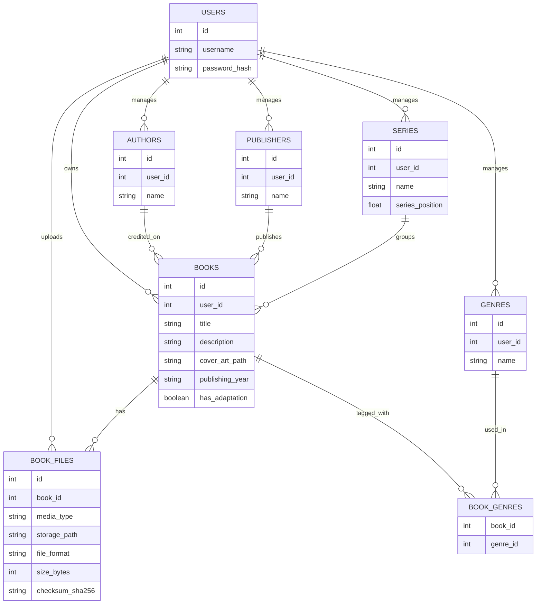
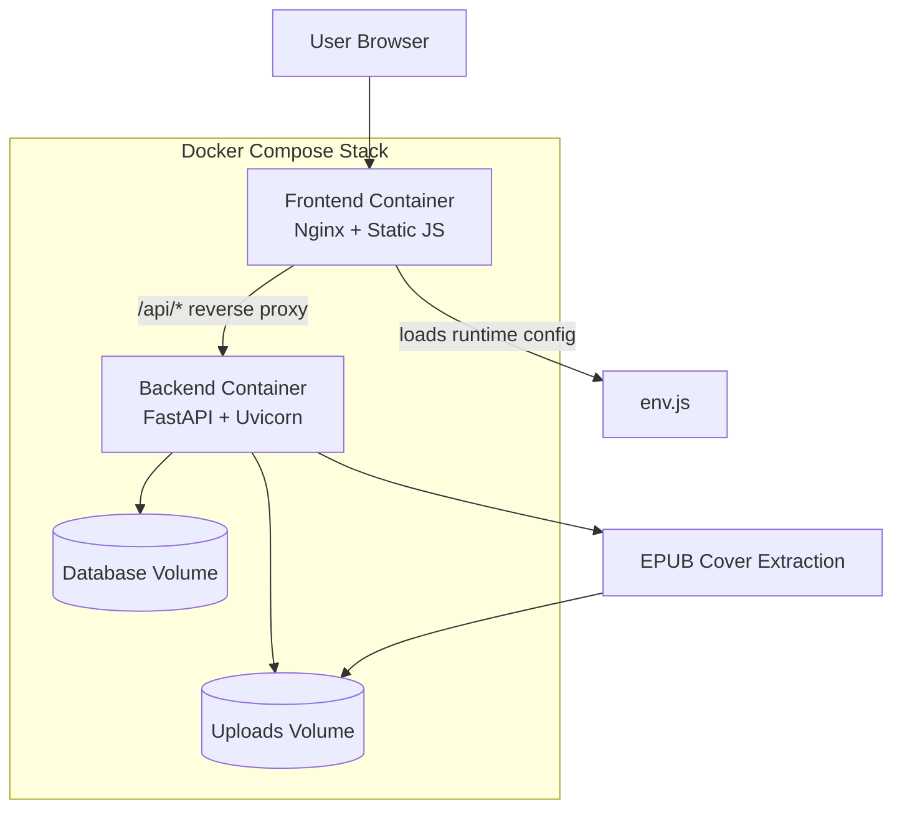

# Final Project Report — Self-Hosted Bookshelf

## Project Summary 

Self-Hosted Bookshelf is a lightweight web app for managing a personal EPUB library. Users can upload EPUB files, create/edit metadata, automatically extract and display cover thumbnails, and download stored books later. The project is designed to be easy to run and self-host using Docker Compose.

## Diagrams

### ERD (Initial Data Model)

### System Design (Docker Compose + Reverse Proxy)

## Demo Video or GIF (TODO)

- `docs/demo.gif`

## What Did You Learn?

- In the future, I would have put more of the code into a single container. My experience has taught me that these are usually separate projects, but for a home server it is much easier and less error-prone to keep the frontend and backend communicating through the same container stack.
- Docker containers have some quirks when it comes to persistent storage across updates. I do not know if I have it all figured out yet, but it was interesting to learn about volumes and how to control them in Docker Compose files.
- AI helped me with this part, but it turns out that you can extract cover images from EPUB files. An EPUB is essentially a ZIP file containing metadata, text, cover art, and other assets. That was very informative and one of the coolest parts of this project.

## Does Your Project Integrate with AI?

This project does not integrate with any AI. It is fully self-contained and does not run any AI or machine learning algorithms.

## How Did You Use AI to Build Your Project?

I used AI to help speed up UI development, testing API requests in Docker containers, and learning the basics of Docker and Docker Compose. It helped me get much more done than I could have done on my own, and it turned into a final product that I will continue to host myself.

## Why This Project Is Interesting to You

As I mentioned previously, I started my home lab journey about six months ago. I host multiple services and share them with my family and friends, like a Jellyfin media server and a file system. I have always been a big reader, so I saw an opportunity to make a similar app for books that can be accessed from anywhere. I am not ready to expose it to the open internet like some of my other services without learning more about security, but I can still access it through my personal VPN service, Tailscale. It is exciting to build a project that I can keep improving over time.

## Engineering Notes (Failover, Scaling, Performance, Authentication, Concurrency)

- Authentication uses Bearer tokens, and protected endpoints only return data for the signed-in user.
- The app is built for a single Docker Compose deployment, with named volumes to preserve the database and uploads across rebuilds.
- Performance comes from pagination, server-side filtering, and extracting cover art once instead of reprocessing EPUB files on every request.
- If the project grows, the backend can be scaled by moving storage and the database to shared infrastructure.

