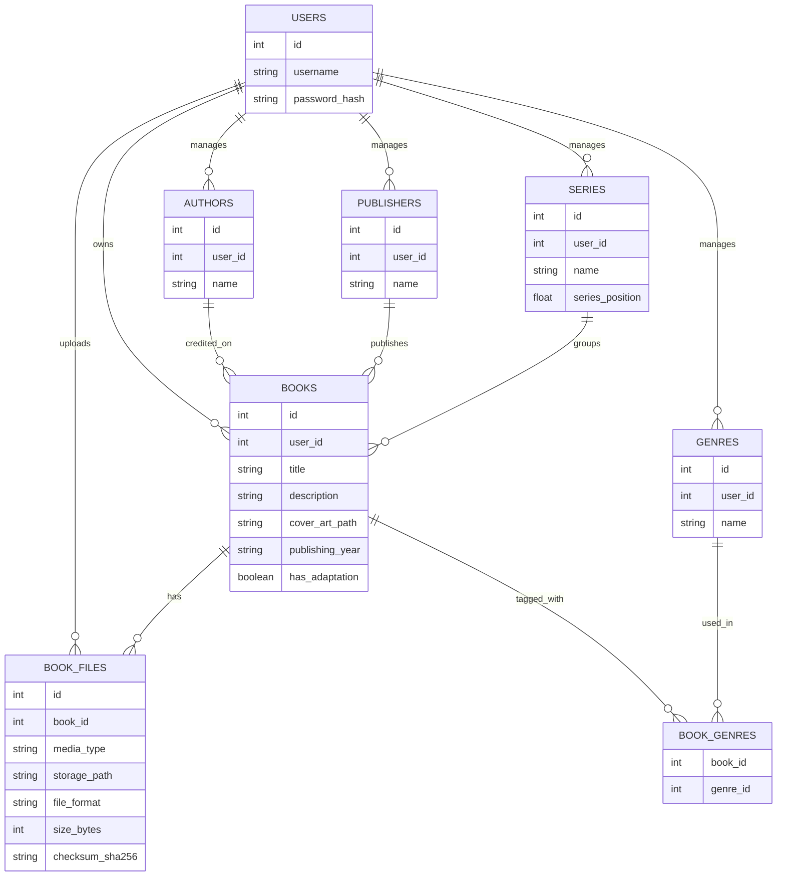
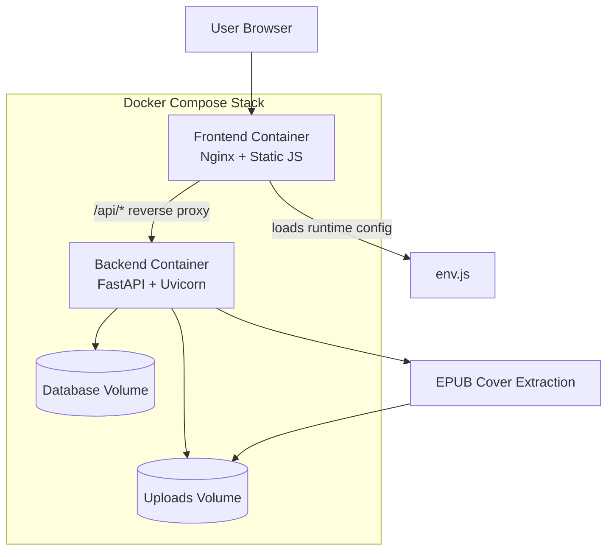

# Self-Hosted Bookshelf Project Initial Design

## Project Purpose and Goals

This project is a self-hosted bookshelf for managing EPUB files by user account. The original plan was to build the data model and backend first, then add a simple frontend that makes it easy to upload a book, fill in metadata, view the library, and later add cover art, downloads, and deployment support for a home server.

The main goals were:

- Keep each user's library isolated.
- Use an upload-first flow so the file is stored before the book record is completed.
- Track core metadata such as title, author, description, publisher, genre, series, and cover art.
- Automatically extract cover art from EPUB files when possible.
- Keep the app easy to run with Docker Compose and easy to move to another machine.
- Leave room for future audiobook support.

This proposal follows the early planning notes in [docs/schema-notes.md](schema-notes.md) and [docs/frontend-flow-notes.md](frontend-flow-notes.md).

## Initial ERD Sketch

## Rough System Design Diagram

## Initial Daily Goals

These are written like the original plan, before the later implementation work was finished.

| Date | Goal |
| --- | --- |
| 4/3/2026 | Define the project scope, sketch the ERD, and decide which metadata fields the library needs. |
| 4/4/2026 | Set up the backend project, database models, and user authentication flow. |
| 4/5/2026 | Build the upload-first API path and verify that EPUB files can be stored safely. |
| 4/6/2026 | Finish the core backend endpoints and update documentation so the frontend is easier to build. |
| 4/7/2026 | Start the frontend scaffold with login and library screens. |
| 4/8/2026 | Build the main library UI and get the book list layout working. |
| 4/9/2026 | Add description and cover image fields to the book form. |
| 4/10/2026 | Implement automatic cover extraction from EPUB files. |
| 4/11/2026 | Add download support for books in the library. |
| 4/12/2026 | Containerize the app and test it locally in Docker Compose. |
| 4/13/2026 | Move the deployment plan toward GitHub and fix frontend-backend communication issues. |
| 4/14/2026 | Run final integration testing, polish the UI, and fix any remaining bugs. |
| 4/15/2026 | Use the buffer day for last-minute fixes, documentation cleanup, and submission prep. |

## Early Plan Summary

The early plan was to prove the backend first, then build the frontend around the upload-first flow, and then add the polish features that make the bookshelf feel complete: cover art, download links, containerization, and a cleaner deployment path.